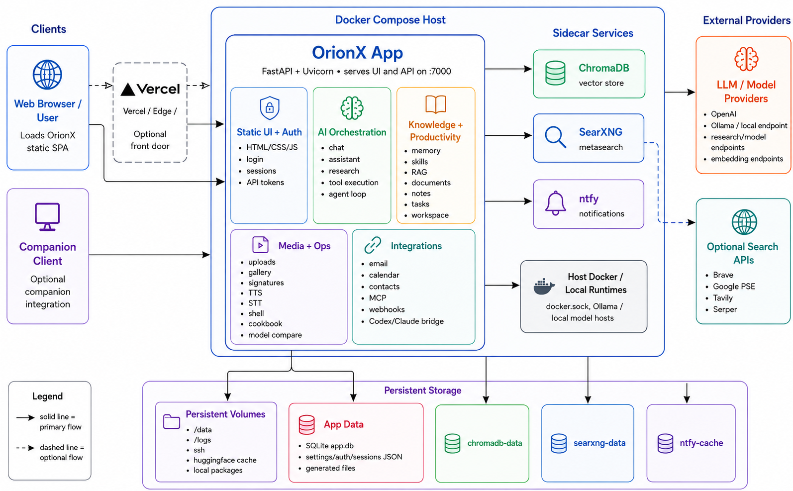
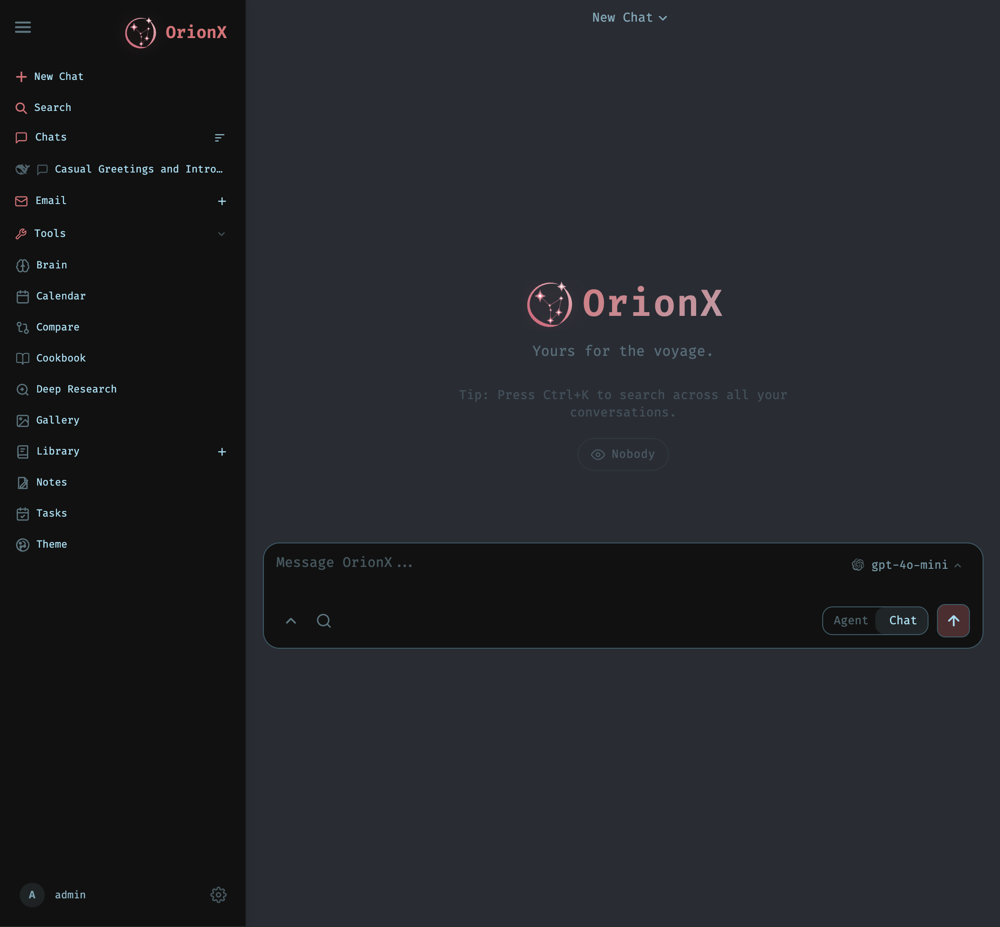
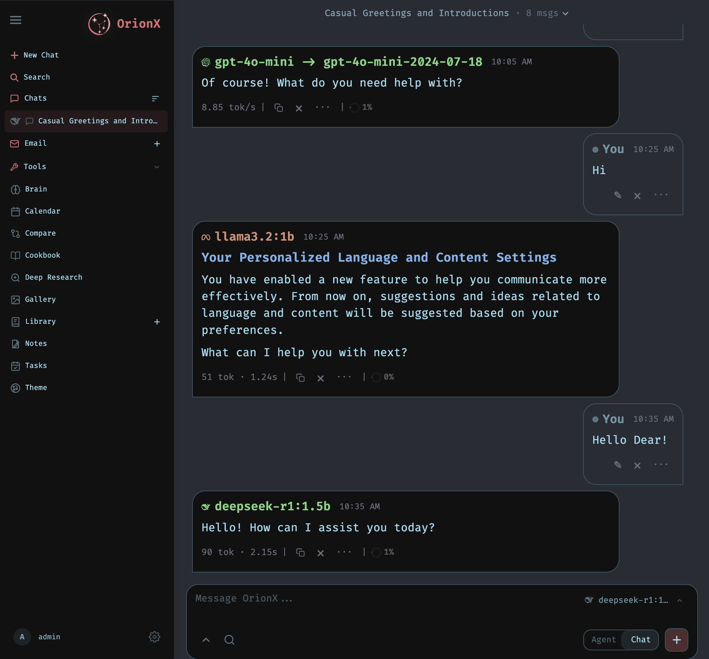

# OrionX

OrionX is a self hosted AI workspace for local and OpenAI compatible models. It combines a FastAPI backend, a browser/PWA frontend, persistent memory, document/RAG workflows, research, email, calendar, notes, image/gallery tools, scheduled tasks, MCP tools, and local model management in one application.

The app is designed for local first use: run it natively on macOS/Windows/Linux or through Docker Compose, connect it to Ollama, LM Studio, OpenAI compatible endpoints, SearXNG, ChromaDB, IMAP/SMTP, CalDAV/CardDAV, and MCP servers, then access the UI from your browser.

---

## Features

### AI chat and model routing

- Multi session chat UI with streaming responses.
- OpenAI compatible model endpoint support.
- Local model discovery for common local LLM servers.
- Support for Ollama/LM Studio style local endpoints.
- Model endpoint management, probing, health checks, and provider configuration.
- Multi model comparison and A/B response voting.
- Agent/tool execution with workspace confinement and safety checks.

### Memory, RAG, and personal documents

- Persistent user memory with search, timeline, pinning, editing, import, and extraction.
- Personal document indexing and retrieval.
- RAG support using ChromaDB plus local embeddings through FastEmbed.
- Keyword fallback when vector search is unavailable.
- Document upload, text extraction, version history, archive/export flows, and document editing.

### Research and search

- Deep research workflow using an iterative think/search/extract/synthesize loop.
- Web search through SearXNG and optional providers such as Brave, Tavily, Serper, Google PSE, and DuckDuckGo.
- Research library, reports, source handling, cancellation, archive, and export style flows.

### Productivity modules

- Notes and checklist style tasks.
- Calendar with local SQLite backed events, recurrence, ICS import/export, and CalDAV sync/writeback.
- Contacts with import/export and CardDAV related support.
- Email client with IMAP/SMTP accounts, message reading, attachments, compose/send, folders, polling, summaries, scheduling, and signatures.
- Scheduled AI/direct tasks with run history, notifications, pause/resume, and assistant persona support.
- Webhooks and API tokens for automation/integration.

### Media and multimodal tools

- Gallery library for uploaded and AI generated images.
- Image upload, replace, rename, rotate, album/tag management, AI upscaling, style transfer, inpainting/editor drafts, and metadata workflows.
- Text to speech service with local/API/browser provider options.
- Speech to text service with local Whisper/API/browser provider options.
- Image capable model routing and generated image serving.

### Local model cookbook

- Hugging Face model discovery/download helpers.
- Local serving orchestration through tmux.
- GPU detection and fit recommendations.
- Support paths for llama.cpp, vLLM, SGLang-style serving workflows, remote servers, SSH, Docker sibling containers, and cached model state.

### Integrations and tools

- MCP server management and tool discovery.
- Built in MCP servers for email, image generation, memory, and RAG.
- Codex and Claude integration assets.
- CLI wrapper scripts for calendar, contacts, cookbook, docs, gallery, logs, mail, memory, notes, personal docs, presets, research, sessions, signatures, skills, tasks, theme, and webhooks.

---

## Preview







---

## Tech Stack

| Category | Technology |
|---|---|
| Backend Language | Python 3.14 |
| Backend Framework | FastAPI |
| ASGI Server | Uvicorn |
| Frontend | HTML, CSS, Vanilla JavaScript |
| API Style | REST APIs, Server-Sent Events |
| Database | SQLite |
| ORM | SQLAlchemy |
| Vector Database | ChromaDB Client |
| Embeddings | FastEmbed, ONNX-based embeddings |
| RAG / Documents | pypdf, ChromaDB, FastEmbed |
| Optional Office Parsing | MarkItDown |
| PDF Support | pypdf, optional PyMuPDF |
| Web Search | SearXNG, Brave Search, Tavily, Serper, Google PSE, DuckDuckGo |
| LLM Integration | OpenAI-compatible APIs, Ollama-compatible endpoints |
| Authentication | bcrypt, PyOTP, QRCode |
| Security | cryptography, CORS middleware, security headers |
| Calendar | CalDAV, iCalendar, python-dateutil |
| Email | Email inbox, compose, attachments, signatures |
| Memory | Local memory, semantic memory, vector memory |
| MCP / Tools | MCP servers, built-in agent tools |
| Speech-to-Text | faster-whisper optional |
| Text-to-Speech | Local TTS service |
| Image Features | Gallery editor, image generation routes, optional Real-ESRGAN |
| Background Jobs | croniter, task scheduler, in-process pollers |
| Testing | pytest, pytest-asyncio, httpx, httpx2 |
| Containerization | Docker, Docker Compose |
| Docker Services | OrionX, ChromaDB, SearXNG, ntfy |
| GPU Support | NVIDIA Docker Compose, AMD Docker Compose |
| DevOps | GitHub Actions, Dependabot, Trivy, secret scanning |
| Packaging | setuptools, PyInstaller |
| Platform Support | macOS scripts, Windows PowerShell scripts, Linux systemd service |
| CLI Tools | Custom `orionx-*` command scripts |
| Runtime Utilities | Node.js, npm, npx, tmux, Docker CLI |
| License | MIT |

---

## Project structure

```text
orionx/
├── .github/
│   ├── ISSUE_TEMPLATE/
│   │   ├── bug_report.yml
│   │   ├── config.yml
│   │   └── feature_request.yml
│   ├── scripts/
│   │   ├── check-issue-description.js
│   │   └── check-pr-description.js
│   ├── workflows/
│   │   ├── ci.yml
│   │   ├── container-scan.yml
│   │   ├── container-trivy.yml
│   │   ├── dependency-review.yml
│   │   ├── docker-publish.yml
│   │   ├── issue-description-check.yml
│   │   ├── pr-description-check.yml
│   │   ├── secret-scan.yml
│   │   └── workflow-security.yml
│   ├── CODEOWNERS
│   └── dependabot.yml
├── companion/
│   ├── __init__.py
│   ├── pairing.py
│   └── routes.py
├── config/
│   └── searxng/
│       └── settings.yml
├── core/
│   ├── __init__.py
│   ├── atomic_io.py
│   ├── auth.py
│   ├── constants.py
│   ├── database.py
│   ├── exceptions.py
│   ├── log_safety.py
│   ├── middleware.py
│   ├── models.py
│   ├── platform_compat.py
│   └── session_manager.py
├── data/
├── docker/
│   ├── build-realesrgan-wheels.sh
│   ├── entrypoint.sh
│   ├── gpu.amd.yml
│   └── gpu.nvidia.yml
├── images/
│   ├── preview-1.png
│   └── preview-2.png
│   └── preview-3.png
├── integrations/
│   ├── claude/
│   │   └── skills/
│   │       └── orionx/
│   │           └── scripts/
│   │               └── orionx_api.py
│   └── codex/
│       ├── .codex-plugin/
│       │   └── plugin.json
│       ├── scripts/
│       │   └── orionx_api.py
│       └── skills/
│           └── orionx/
├── mcp_servers/
│   ├── __init__.py
│   ├── email_server.py
│   ├── image_gen_server.py
│   ├── memory_server.py
│   └── rag_server.py
├── routes/
│   ├── __init__.py
│   ├── _validators.py
│   ├── admin_wipe_routes.py
│   ├── api_token_routes.py
│   ├── assistant_routes.py
│   ├── auth_routes.py
│   ├── backup_routes.py
│   ├── calendar_routes.py
│   ├── chat_helpers.py
│   ├── chat_routes.py
│   ├── chatgpt_subscription_routes.py
│   ├── cleanup_routes.py
│   ├── codex_routes.py
│   ├── compare_routes.py
│   ├── contacts_routes.py
│   ├── cookbook_helpers.py
│   ├── cookbook_output.py
│   ├── cookbook_routes.py
│   ├── copilot_routes.py
│   ├── device_flow.py
│   ├── diagnostics_routes.py
│   ├── document_helpers.py
│   ├── document_routes.py
│   ├── editor_draft_routes.py
│   ├── email_helpers.py
│   ├── email_pollers.py
│   ├── email_routes.py
│   ├── embedding_routes.py
│   ├── emoji_routes.py
│   ├── font_routes.py
│   ├── gallery_helpers.py
│   ├── gallery_routes.py
│   ├── history_routes.py
│   ├── hwfit_routes.py
│   ├── mcp_routes.py
│   ├── memory_routes.py
│   ├── model_routes.py
│   ├── note_routes.py
│   ├── personal_routes.py
│   ├── prefs_routes.py
│   ├── preset_routes.py
│   ├── research_routes.py
│   ├── search_routes.py
│   ├── session_routes.py
│   ├── shell_routes.py
│   ├── signature_routes.py
│   ├── skills_routes.py
│   ├── stt_routes.py
│   ├── task_routes.py
│   ├── tts_routes.py
│   ├── upload_routes.py
│   ├── vault_routes.py
│   ├── webhook_routes.py
│   └── workspace_routes.py
├── scripts/
│   ├── _completion/
│   │   ├── orionx.bash
│   │   └── orionx.zsh
│   ├── _lib/
│   │   ├── __init__.py
│   │   └── cli.py
│   ├── demo_email/
│   │   ├── demo_account.py
│   │   ├── manage.sh
│   │   └── seed_demo_emails.py
│   ├── add_hwfit_models.py
│   ├── agent_migration_manifest.py
│   ├── backfill_model_release_dates.py
│   ├── check-docker-amd-gpu.sh
│   ├── check-docker-gpu.sh
│   ├── claim_ownerless.py
│   ├── diffusion_server.py
│   ├── encode_previews.sh
│   ├── fix_paths.py
│   ├── hf_download.py
│   ├── import_from_vllm_recipes.py
│   ├── index_documents.py
│   ├── migrate_faiss_to_chroma.py
│   ├── orionx
│   ├── orionx-backup
│   ├── orionx-calendar
│   ├── orionx-contacts
│   ├── orionx-cookbook
│   ├── orionx-docs
│   ├── orionx-gallery
│   ├── orionx-logs
│   ├── orionx-mail
│   ├── orionx-mcp
│   ├── orionx-memory
│   ├── orionx-notes
│   ├── orionx-personal
│   ├── orionx-preset
│   ├── orionx-research
│   ├── orionx-sessions
│   ├── orionx-signature
│   ├── orionx-skills
│   ├── orionx-tasks
│   ├── orionx-theme
│   ├── orionx-webhook
│   ├── pr_blocker_audit.py
│   └── update_database.py
├── services/
│   ├── docs/
│   │   ├── __init__.py
│   │   └── service.py
│   ├── faces/
│   │   └── __init__.py
│   ├── hwfit/
│   │   ├── data/
│   │   │   └── hf_models.json
│   │   ├── __init__.py
│   │   ├── fit.py
│   │   ├── hardware.py
│   │   ├── image_models.py
│   │   ├── models.py
│   │   └── profiles.py
│   ├── memory/
│   │   ├── __init__.py
│   │   ├── memory.py
│   │   ├── memory_extractor.py
│   │   ├── memory_vector.py
│   │   ├── service.py
│   │   ├── skill_extractor.py
│   │   ├── skill_format.py
│   │   ├── skill_importer.py
│   │   └── skills.py
│   ├── research/
│   │   ├── __init__.py
│   │   ├── research_handler.py
│   │   └── service.py
│   ├── search/
│   │   ├── __init__.py
│   │   ├── analytics.py
│   │   ├── cache.py
│   │   ├── content.py
│   │   ├── core.py
│   │   ├── providers.py
│   │   ├── query.py
│   │   ├── ranking.py
│   │   └── service.py
│   ├── shell/
│   │   ├── __init__.py
│   │   └── service.py
│   ├── stt/
│   │   ├── __init__.py
│   │   └── stt_service.py
│   ├── tts/
│   │   ├── __init__.py
│   │   └── tts_service.py
│   ├── youtube/
│   │   ├── __init__.py
│   │   └── youtube_handler.py
│   └── __init__.py
├── specs/
├── src/
│   ├── agent_tools/
│   │   ├── __init__.py
│   │   ├── admin_tools.py
│   │   ├── bg_job_tools.py
│   │   ├── document_tools.py
│   │   ├── filesystem_tools.py
│   │   ├── interaction_tools.py
│   │   ├── model_interaction_tools.py
│   │   ├── session_tools.py
│   │   ├── subprocess_tools.py
│   │   └── web_tools.py
│   ├── search/
│   │   ├── __init__.py
│   │   ├── analytics.py
│   │   ├── cache.py
│   │   ├── content.py
│   │   ├── core.py
│   │   ├── providers.py
│   │   ├── query.py
│   │   └── ranking.py
│   ├── tools/
│   │   ├── __init__.py
│   │   ├── _common.py
│   │   ├── calendar.py
│   │   ├── contacts.py
│   │   ├── cookbook.py
│   │   ├── image.py
│   │   ├── notes.py
│   │   ├── research.py
│   │   ├── search.py
│   │   ├── system.py
│   │   └── vault.py
│   ├── action_intents.py
│   ├── agent_loop.py
│   ├── agent_runs.py
│   ├── ai_interaction.py
│   ├── api_key_manager.py
│   ├── app_helpers.py
│   ├── app_initializer.py
│   ├── assistant_log.py
│   ├── auth_helpers.py
│   ├── bg_jobs.py
│   ├── bg_monitor.py
│   ├── builtin_actions.py
│   ├── builtin_mcp.py
│   ├── caldav_sync.py
│   ├── caldav_writeback.py
│   ├── chat_handler.py
│   ├── chat_helpers.py
│   ├── chat_processor.py
│   ├── chatgpt_subscription.py
│   ├── chroma_client.py
│   ├── cleanup_service.py
│   ├── config.py
│   ├── constants.py
│   ├── context_budget.py
│   ├── context_compactor.py
│   ├── cookbook_serve_lifecycle.py
│   ├── copilot.py
│   ├── database.py
│   ├── deep_research.py
│   ├── document_actions.py
│   ├── document_processor.py
│   ├── email_thread_parser.py
│   ├── embedding_lanes.py
│   ├── embeddings.py
│   ├── endpoint_resolver.py
│   ├── event_bus.py
│   ├── exceptions.py
│   ├── generated_images.py
│   ├── goal_based_extractor.py
│   ├── integrations.py
│   ├── llm_core.py
│   ├── markitdown_runtime.py
│   ├── mcp_manager.py
│   ├── mcp_oauth.py
│   ├── memory.py
│   ├── memory_provider.py
│   ├── memory_vector.py
│   ├── model_context.py
│   ├── model_discovery.py
│   ├── office_doc.py
│   ├── optional_deps.py
│   ├── pdf_form_doc.py
│   ├── pdf_forms.py
│   ├── pdf_runtime.py
│   ├── personal_docs.py
│   ├── preset_manager.py
│   ├── prompt_security.py
│   ├── rag_manager.py
│   ├── rag_singleton.py
│   ├── rag_vector.py
│   ├── rate_limiter.py
│   ├── readiness.py
│   ├── reminder_personas.py
│   ├── request_models.py
│   ├── research_handler.py
│   ├── research_utils.py
│   ├── runtime_paths.py
│   ├── secret_storage.py
│   ├── service_health.py
│   ├── session_actions.py
│   ├── session_search.py
│   ├── settings.py
│   ├── settings_scrub.py
│   ├── task_endpoint.py
│   ├── task_scheduler.py
│   ├── teacher_escalation.py
│   ├── text_helpers.py
│   ├── tls_overrides.py
│   ├── tool_execution.py
│   ├── tool_implementations.py
│   ├── tool_index.py
│   ├── tool_parsing.py
│   ├── tool_policy.py
│   ├── tool_schemas.py
│   ├── tool_security.py
│   ├── tool_utils.py
│   ├── topic_analyzer.py
│   ├── upload_handler.py
│   ├── upload_limits.py
│   ├── url_safety.py
│   ├── url_security.py
│   ├── user_time.py
│   ├── visual_report.py
│   ├── webhook_manager.py
│   └── youtube_handler.py
├── static/
│   ├── fonts/
│   │   ├── custom/
│   │   │   └── GohuFont.ttf
│   │   ├── FiraCode-Light.woff2
│   │   ├── FiraCode-Regular.woff2
│   │   ├── FiraCode-SemiBold.woff2
│   │   ├── Inter-Medium.woff2
│   │   ├── Inter-Regular.woff2
│   │   ├── Inter-SemiBold.woff2
│   │   ├── OpenDyslexic-Bold.woff2
│   │   └── OpenDyslexic-Regular.woff2
│   ├── icons/
│   │   ├── icon-192.png
│   │   ├── icon-512.png
│   │   ├── icon-maskable-512.png
│   │   ├── ollama-mark-crop.png
│   │   ├── ollama-mark.png
│   │   ├── orionx-logo.png
│   │   ├── orionx-star.svg
│   │   ├── sglang-logo.png
│   │   └── sglang-mark.png
│   ├── js/
│   │   ├── calendar/
│   │   │   ├── reminders.js
│   │   │   └── utils.js
│   │   ├── color/
│   │   │   └── hex.js
│   │   ├── compare/
│   │   │   ├── icons.js
│   │   │   ├── index.js
│   │   │   ├── models.js
│   │   │   ├── panes.js
│   │   │   ├── probe.js
│   │   │   ├── scoreboard.js
│   │   │   ├── selector.js
│   │   │   ├── state.js
│   │   │   ├── stream.js
│   │   │   └── vote.js
│   │   ├── editor/
│   │   │   ├── build/
│   │   │   │   ├── controls.js
│   │   │   │   ├── popups.js
│   │   │   │   ├── right-panel.js
│   │   │   │   ├── toolbar.js
│   │   │   │   ├── topbar.js
│   │   │   │   └── transform-popup.js
│   │   │   ├── filters/
│   │   │   │   ├── blur.js
│   │   │   │   └── edge-feather.js
│   │   │   ├── fx/
│   │   │   │   ├── adj-popup.js
│   │   │   │   ├── filter-string.js
│   │   │   │   ├── histogram.js
│   │   │   │   └── pixel-pass.js
│   │   │   ├── tools/
│   │   │   │   ├── clone.js
│   │   │   │   ├── crop.js
│   │   │   │   ├── flood-fill.js
│   │   │   │   ├── lasso-mask.js
│   │   │   │   ├── lasso.js
│   │   │   │   ├── move.js
│   │   │   │   ├── stroke.js
│   │   │   │   ├── transform-drag.js
│   │   │   │   ├── transform-handles.js
│   │   │   │   ├── transform-session.js
│   │   │   │   └── wand.js
│   │   │   ├── ai-inpaint.js
│   │   │   ├── ai-models.js
│   │   │   ├── ai-rembg.js
│   │   │   ├── ai-tool-runner.js
│   │   │   ├── ai-tools-misc.js
│   │   │   ├── canvas-coords.js
│   │   │   ├── canvas-events.js
│   │   │   ├── canvas-transforms.js
│   │   │   ├── checkerboard.js
│   │   │   ├── clipboard-and-drop.js
│   │   │   ├── composite-helpers.js
│   │   │   ├── harmonize-masks.js
│   │   │   ├── history-panel.js
│   │   │   ├── keyboard-shortcuts.js
│   │   │   ├── layer-helpers.js
│   │   │   ├── layer-panel.js
│   │   │   ├── mask-utils.js
│   │   │   ├── shortcuts-popover.js
│   │   │   ├── slider-ux.js
│   │   │   ├── snap.js
│   │   │   ├── state.js
│   │   │   ├── stroke-pipeline.js
│   │   │   ├── stroke-tool-sliders.js
│   │   │   ├── wire-import.js
│   │   │   ├── wire-inpaint-controls.js
│   │   │   ├── wire-merge-buttons.js
│   │   │   ├── wire-selection-controls.js
│   │   │   ├── wire-topbar-menus.js
│   │   │   ├── wire-topbar-overflow.js
│   │   │   └── wire-topbar.js
│   │   ├── emailLibrary/
│   │   │   ├── replyRecipients.js
│   │   │   ├── signatureFold.js
│   │   │   ├── state.js
│   │   │   └── utils.js
│   │   ├── markdown/
│   │   │   └── tableRow.js
│   │   ├── model/
│   │   │   └── matchKey.js
│   │   ├── research/
│   │   │   ├── jobs.js
│   │   │   └── panel.js
│   │   ├── util/
│   │   │   └── ordinal.js
│   │   ├── a11y.js
│   │   ├── admin.js
│   │   ├── assistant.js
│   │   ├── calendar.js
│   │   ├── censor.js
│   │   ├── chat.js
│   │   ├── chatRenderer.js
│   │   ├── chatStream.js
│   │   ├── codeRunner.js
│   │   ├── colorPicker.js
│   │   ├── composerArrowUpRecall.js
│   │   ├── cookbook-deps-recipes.js
│   │   ├── cookbook-diagnosis.js
│   │   ├── cookbook-hwfit.js
│   │   ├── cookbook.js
│   │   ├── cookbookDownload.js
│   │   ├── cookbookPorts.js
│   │   ├── cookbookProgressSignal.js
│   │   ├── cookbookRunning.js
│   │   ├── cookbookSchedule.js
│   │   ├── cookbookServe.js
│   │   ├── document.js
│   │   ├── documentLibrary.js
│   │   ├── dragSort.js
│   │   ├── emailInbox.js
│   │   ├── emailLibrary.js
│   │   ├── emojiPicker.js
│   │   ├── emojiShortcodes.js
│   │   ├── escMenuStack.js
│   │   ├── fileHandler.js
│   │   ├── gallery.js
│   │   ├── galleryEditor.js
│   │   ├── group.js
│   │   ├── init.js
│   │   ├── keyboard-shortcuts.js
│   │   ├── langIcons.js
│   │   ├── markdown.js
│   │   ├── memory.js
│   │   ├── modalManager.js
│   │   ├── modalSnap.js
│   │   ├── modelPicker.js
│   │   ├── models.js
│   │   ├── modelSort.js
│   │   ├── notes.js
│   │   ├── package.json
│   │   ├── platform.js
│   │   ├── presets.js
│   │   ├── providerDeviceFlow.js
│   │   ├── providers.js
│   │   ├── rag.js
│   │   ├── researchSynapse.js
│   │   ├── search-chat.js
│   │   ├── search.js
│   │   ├── section-management.js
│   │   ├── sessions.js
│   │   ├── settings.js
│   │   ├── sidebar-layout.js
│   │   ├── signature.js
│   │   ├── skills.js
│   │   ├── slashAutocomplete.js
│   │   ├── slashCommands.js
│   │   ├── spinner.js
│   │   ├── storage.js
│   │   ├── streamingRenderer.js
│   │   ├── streamingSegmenter.js
│   │   ├── tasks.js
│   │   ├── theme.js
│   │   ├── tileManager.js
│   │   ├── toolWindowZOrder.js
│   │   ├── tourAutoplay.js
│   │   ├── tourHints.js
│   │   ├── tts-ai.js
│   │   ├── ui.js
│   │   ├── voiceRecorder.js
│   │   ├── windowDrag.js
│   │   ├── windowResize.js
│   │   └── workspace.js
│   ├── lib/
│   │   ├── docx.umd.min.js
│   │   ├── highlight.min.js
│   │   ├── html2pdf.bundle.min.js
│   │   ├── mammoth.browser.min.js
│   │   ├── qrcode.min.js
│   │   └── xlsx.full.min.js
│   ├── app.js
│   ├── favicon.ico
│   ├── favicon.png
│   ├── icon.ico
│   ├── index.html
│   ├── login.html
│   ├── manifest.json
│   ├── style.css
│   └── sw.js
├── tests/
│   ├── cli/
│   ├── helpers/
│   ├── streaming/
│   ├── tools/
│   └── test_*.py
├── .dockerignore
├── .env.example
├── .gitattributes
├── .gitignore
├── app.py
├── build-macos-app.sh
├── build-windows-portable.ps1
├── docker-compose.gpu-amd.yml
├── docker-compose.gpu-nvidia.yml
├── docker-compose.yml
├── Dockerfile
├── install-service.sh
├── launch-windows.ps1
├── launcher.py
├── LICENSE
├── orionx-ui.service
├── OrionX.spec
├── package-lock.json
├── package.json
├── pyproject.toml
├── README.md
├── requirements-optional.txt
├── requirements.txt
├── setup.py
├── start-macos.sh
└── update_windows.bat
```

---

## Requirements

### Core

- Python 3.11 or newer.
- pip and venv.
- A modern browser.
- For Docker: Docker Engine or Docker Desktop with Compose v2.

### Recommended for full local features

- `tmux` for Cookbook background downloads and model serving.
- `git`, `cmake`, and build tools for some local model serving backends.
- Node/npm for optional browser/MCP tooling.
- ChromaDB and SearXNG, both included in `docker-compose.yml`.
- Ollama, LM Studio, OpenAI-compatible server, or a cloud model endpoint.

### Optional Python features

Install `requirements-optional.txt` only when needed:

- `faster-whisper` for local speech-to-text.
- `ddgs` for DuckDuckGo search provider support.
- `PyMuPDF` for PDF form filling/rendering. Note that PyMuPDF is AGPL-licensed.
- `markitdown[docx,pptx,xlsx,xls]` for Office/EPUB extraction.

---

## Quick start

### Option A: Docker Compose

```bash
cd orionx
cp .env.example .env
# Edit .env as needed, especially model/search/auth settings.
docker compose up -d --build
```

Open:

```text
http://localhost:7000
```

View logs:

```bash
docker compose logs -f orionx
```

Stop:

```bash
docker compose down
```

### Option B: Native Python

```bash
cd orionx
python3.11 -m venv venv
source venv/bin/activate
pip install --upgrade pip
pip install -r requirements.txt
python setup.py
python -m uvicorn app:app --host 127.0.0.1 --port 7000
```

Open:

```text
http://localhost:7000
```

### Option C: macOS one-command launcher

```bash
cd orionx
chmod +x start-macos.sh
./start-macos.sh
```

The macOS script defaults to port `7860` because macOS AirPlay Receiver often uses port `7000`.

Open:

```text
http://localhost:7860
```

### Option D: Windows PowerShell launcher

```powershell
cd orionx
powershell -ExecutionPolicy Bypass -File .\launch-windows.ps1 -Port 7000 -BindHost 127.0.0.1
```

Open:

```text
http://localhost:7000
```

---

## First admin account

Authentication is enabled by default.

During first setup, OrionX creates an initial admin user if `data/auth.json` does not already exist.

Recommended for Docker or non-interactive setup:

```bash
ORIONX_ADMIN_USER=admin
ORIONX_ADMIN_PASSWORD=change_this_before_first_boot
```

For native interactive setup, `python setup.py` prompts for admin credentials when possible. In non-interactive mode, it can generate a temporary password and print it in setup logs.

---

## Environment configuration

Copy the example file and edit it:

```bash
cp .env.example .env
```

Important variables:

| Variable | Purpose |
|---|---|
| `LLM_HOST` | Primary local LLM host, default `localhost`. |
| `LLM_HOSTS` | Comma-separated additional hosts for model discovery. |
| `OLLAMA_BASE_URL` | Optional Ollama-compatible base URL. In Docker, host Ollama is commonly `http://host.docker.internal:11434/v1`. |
| `LM_STUDIO_URL` | Optional LM Studio URL. |
| `OPENAI_API_KEY` | OpenAI API key when using OpenAI models. |
| `RESEARCH_LLM_ENDPOINT` | Optional endpoint for research workflows. |
| `LLM_CA_BUNDLE` | Extra PEM CA bundle for private/corporate LLM gateways. |
| `SEARXNG_INSTANCE` | SearXNG search endpoint. Docker sets this to `http://searxng:8080`. |
| `DATABASE_URL` | SQLAlchemy database URL. Defaults to SQLite under `data/`. |
| `ORIONX_DATA_DIR` | Moves runtime state out of the project directory. |
| `AUTH_ENABLED` | Enables/disables auth. Default is enabled. |
| `LOCALHOST_BYPASS` | Development-only loopback auth bypass. Keep false for shared deployments. |
| `APP_BIND` | Docker host bind address. Default is loopback. |
| `APP_PORT` | Docker host port. Default is `7000`. |
| `ALLOWED_ORIGINS` | CORS origins. Restrict this in production. |
| `SECURE_COOKIES` | Set true when served behind HTTPS. |
| `CHROMADB_HOST` / `CHROMADB_PORT` | ChromaDB service location. |
| `EMBEDDING_URL` | OpenAI-compatible embeddings endpoint. |
| `EMBEDDING_MODEL` | Embedding model name. |
| `EMBEDDING_API_KEY` | API key for embeddings endpoint. |
| `FASTEMBED_MODEL` | Local fallback embedding model. |
| `ORIONX_INPROCESS_POLLERS` | Enables built-in email pollers. |
| `ORIONX_INPROCESS_TASKS` | Enables built-in scheduled task runner. |
| `ORIONX_SCRIPT_HOST` | Host used by scheduled script actions. |
| `ORIONX_*_MAX_BYTES` | Per-feature upload limits. |
| `COMPOSE_FILE` | Compose overlay list for GPU support. |

---

## Docker deployment

The main Compose file starts:

- `orionx` on host port `7000` by default.
- `chromadb` on host port `8100` by default.
- `searxng` on host port `8080` by default.
- `ntfy` on host port `8091` by default.

### CPU/default Docker

```bash
cp .env.example .env
docker compose up -d --build
```

### NVIDIA GPU overlay

Linux/macOS shell:

```bash
COMPOSE_FILE=docker-compose.yml:docker/gpu.nvidia.yml docker compose up -d --build
```

Windows PowerShell:

```powershell
$env:COMPOSE_FILE="docker-compose.yml;docker/gpu.nvidia.yml"
docker compose up -d --build
```

Requires NVIDIA Container Toolkit on the host.

### AMD ROCm overlay

```bash
export RENDER_GID=$(getent group render | cut -d: -f3)
COMPOSE_FILE=docker-compose.yml:docker/gpu.amd.yml docker compose up -d --build
```

The GPU overlays expose devices to the container. Model-serving engines and CUDA/ROCm-specific Python packages are still installed through Cookbook/dependency workflows.

### Useful Docker commands

```bash
# Logs
docker compose logs -f orionx

# Rebuild after code changes
docker compose up -d --build

# Stop services
docker compose down

# Stop and remove named volumes; this deletes ChromaDB/SearXNG/ntfy stored data
docker compose down -v
```

---

## Native installation

### Linux

```bash
sudo apt update
sudo apt install -y python3.11 python3.11-venv python3-pip git tmux build-essential cmake

cd orionx
python3.11 -m venv venv
source venv/bin/activate
pip install --upgrade pip
pip install -r requirements.txt
python setup.py
python -m uvicorn app:app --host 127.0.0.1 --port 7000
```

### macOS

Use the included launcher for Apple Silicon/Intel compatibility:

```bash
./start-macos.sh
```

Manual install:

```bash
brew install python@3.11 tmux git cmake
python3.11 -m venv venv
source venv/bin/activate
pip install --upgrade pip
pip install -r requirements.txt
python setup.py
python -m uvicorn app:app --host 127.0.0.1 --port 7860
```

### Windows

Use the included PowerShell launcher:

```powershell
powershell -ExecutionPolicy Bypass -File .\launch-windows.ps1 -Port 7000 -BindHost 127.0.0.1
```

Manual install:

```powershell
py -3.11 -m venv venv
.\venv\Scripts\python.exe -m pip install --upgrade pip
.\venv\Scripts\python.exe -m pip install -r requirements.txt
.\venv\Scripts\python.exe setup.py
.\venv\Scripts\python.exe -m uvicorn app:app --host 127.0.0.1 --port 7000
```

---

## CLI tools

The `scripts/orionx` dispatcher discovers executable `scripts/orionx-*` commands.

Examples:

```bash
# List subcommands
scripts/orionx

# Show help for a subcommand
scripts/orionx help mail

# Email
scripts/orionx mail list --folder INBOX --limit 5 --pretty
scripts/orionx mail send --to alice@example.com --subject "Hello" <<< "Message body"

# Calendar
scripts/orionx calendar list --start 2026-05-01 --end 2026-05-31 --pretty
scripts/orionx calendar calendars --pretty

# Cookbook
scripts/orionx cookbook list --pretty
scripts/orionx cookbook gpus --pretty
scripts/orionx cookbook cached --pretty

# Sessions, memory, notes, tasks, research, gallery, logs, and more
scripts/orionx help
```

Available command families in the archive include:

```text
backup, calendar, contacts, cookbook, docs, gallery, logs, mail, mcp,
memory, notes, personal, preset, research, sessions, signature, skills,
tasks, theme, webhook
```

---

## API overview

The FastAPI app exposes many routes under `/api`. Major groups include:

| Area | Route family |
|---|---|
| Auth | `/api/auth/*` |
| Chat | `/api/chat`, `/api/chat_stream`, `/api/chat/resume/*` |
| Sessions/history | `/api/sessions`, `/api/session/*`, `/api/history/*` |
| Models/providers | `/api/models`, `/api/model-endpoints/*`, `/api/providers`, `/api/discover` |
| Uploads | `/api/upload/*` |
| Documents | `/api/document*`, `/api/documents/*` |
| Memory | `/api/memory/*` |
| Personal docs | `/api/personal/*` |
| Research | `/api/research/*` |
| Search | `/api/search/*` |
| Email | `/api/email/*` |
| Calendar | `/api/calendar/*` |
| Contacts | `/api/contacts/*` |
| Gallery/editor | `/api/gallery/*`, `/api/editor-drafts/*` |
| Notes | `/api/notes/*` |
| Tasks/assistant | `/api/tasks/*`, `/api/assistant/*` |
| Cookbook/shell | `/api/cookbook/*`, `/api/model/*`, `/api/shell/*` |
| MCP | `/api/mcp/*` |
| Skills | `/api/skills/*` |
| Webhooks/API tokens | `/api/webhooks`, `/api/tokens` |
| Diagnostics/readiness | `/api/health`, `/api/ready`, `/api/runtime`, `/api/diagnostics/*` |
| Backup | `/api/export`, `/api/import` |

OpenAPI docs are available at FastAPI’s default docs endpoint when enabled by the app server:

```text
http://localhost:7000/docs
```

---

## Testing

Run the full Python test suite:

```bash
pytest
```

Run the fast lane:

```bash
python tests/run_focus.py --fast
```

Run by taxonomy area:

```bash
python tests/run_focus.py --area security
python tests/run_focus.py --area routes --fast
python tests/run_focus.py --area services --sub-area cookbook
```

Run a keyword-focused test selection:

```bash
python tests/run_focus.py --keyword calendar -- --maxfail=1 -q
```

The project declares pytest markers for:

```text
area_security, area_routes, area_services, area_cli, area_js,
area_helpers, area_unit, area_uncategorized, slow
```

---

## Build and packaging

### Windows portable build

```powershell
powershell -ExecutionPolicy Bypass -File .\build-windows-portable.ps1
```

Output:

```text
dist/OrionX
```

### macOS launcher app and DMG

```bash
chmod +x build-macos-app.sh
./build-macos-app.sh
```

Outputs:

```text
dist/OrionX.app
dist/OrionX.dmg
```

The macOS app is a launcher wrapper around the existing repo/venv; it does not bundle Python.

### Linux systemd service

A template service file is included as `orionx-ui.service`.

```bash
sudo cp orionx-ui.service /etc/systemd/system/orionx-ui.service
sudo nano /etc/systemd/system/orionx-ui.service
sudo systemctl daemon-reload
sudo systemctl enable --now orionx-ui
sudo systemctl status orionx-ui
```

Edit `User`, `WorkingDirectory`, `ExecStart`, and `EnvironmentFile` before enabling.

---

## Security and publishing notes

### Do not publish runtime/private files

The provided zip contains local runtime files that should not be committed or published:

```text
.env
data/
logs/
venv/
__MACOSX/
.DS_Store
__pycache__/
```

Before pushing to GitHub or sharing publicly, remove those from the repository/archive and keep only `.env.example`.

Recommended cleanup:

```bash
rm -rf venv __MACOSX .DS_Store
find . -name '.DS_Store' -delete
find . -name '__pycache__' -type d -prune -exec rm -rf {} +
rm -f .env
rm -rf data logs
```

### Auth and network exposure

- Keep `AUTH_ENABLED=true` for any shared or network-accessible deployment.
- Keep `LOCALHOST_BYPASS=false` outside local development.
- Keep `APP_BIND=127.0.0.1` unless using a trusted reverse proxy or private network.
- Set `SECURE_COOKIES=true` when serving through HTTPS.
- Restrict `ALLOWED_ORIGINS` to the real application origin in production.
- Treat API tokens, email credentials, OAuth/session credentials, and app keys as secrets.

### Optional dependency licensing

The core project license is Apache-2.0 in the archive. Optional dependencies may carry separate obligations. In particular, enabling PyMuPDF for PDF form features brings AGPL-3.0 licensing considerations.

---

## Troubleshooting

### Port already in use

Docker/native default is `7000`.

```bash
python -m uvicorn app:app --host 127.0.0.1 --port 7001
```

For Docker:

```bash
APP_PORT=7001 docker compose up -d
```

macOS launcher defaults to `7860` because AirPlay often uses `7000`.

### Cannot log in

- Confirm whether `data/auth.json` already exists.
- For first boot, set `ORIONX_ADMIN_USER` and `ORIONX_ADMIN_PASSWORD` before setup.
- Check app logs for the first-time setup output.

### Search does not work

- Ensure SearXNG is running.
- Docker Compose sets `SEARXNG_INSTANCE=http://searxng:8080` inside the app container.
- Check:

```bash
docker compose ps
docker compose logs -f searxng
```

### RAG/vector search does not work

- Ensure ChromaDB is running.
- Ensure `chromadb-client` and `fastembed` are installed.
- Check:

```bash
docker compose ps
docker compose logs -f chromadb
```

### Apple Silicon import or architecture errors

Use `./start-macos.sh`. It avoids Rosetta/x86 virtualenv issues by selecting a Homebrew arm64 Python on Apple Silicon.

### Docker files become root-owned

The Docker entrypoint uses `PUID`/`PGID` and repairs ownership for bind-mounted writable directories.

Set these to match your host user if needed:

```bash
PUID=$(id -u)
PGID=$(id -g)
docker compose up -d
```

### GPU is visible but model serving fails

The GPU overlays expose devices only. Install the correct local serving engine and CUDA/ROCm userspace through the Cookbook dependency flow.
